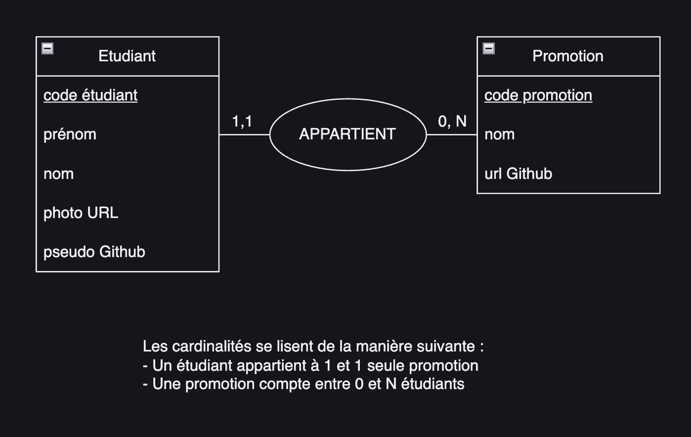
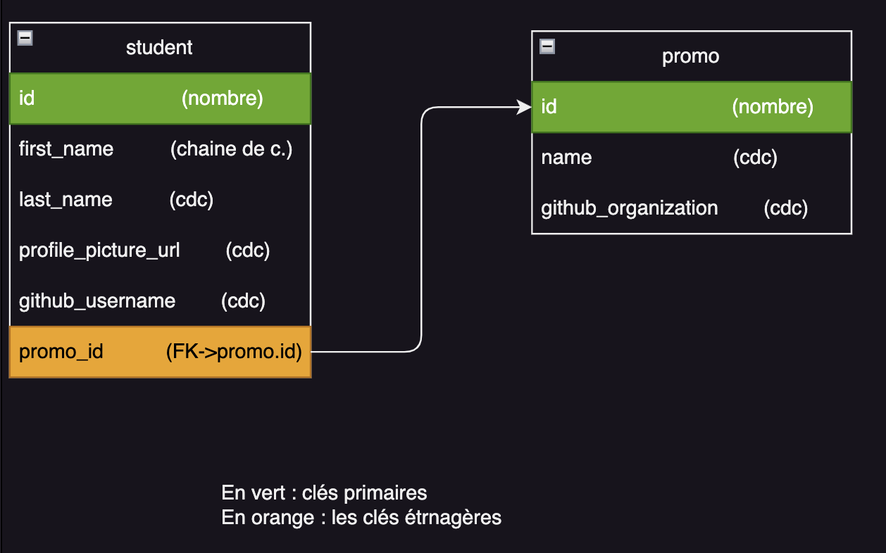
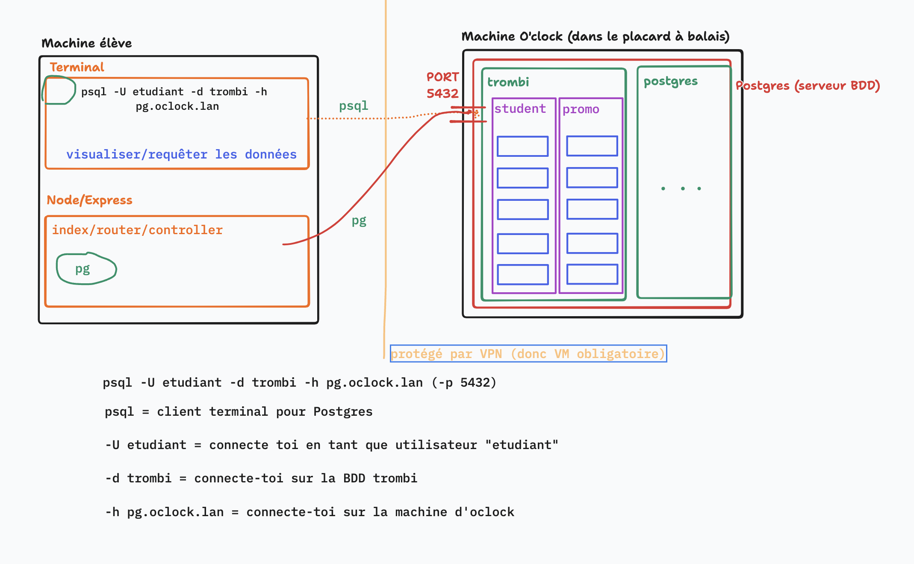

# S04E02 - Trombinoclock - Introduction aux SGBD

## Menu du jour

```
### Matin 

- Correction
  - route `/promo/:id/students`
  - route `/student/:id`
  - dossier public
  - librairie CSS

- Modélisation de base de données
  - MCD
  - MLD
  - MPD

### Après-midi

- Découverte PostgreSQL
  - Vocabulaire
  - Serveur `Postgres`
  - Client terminal `psql`
  - Requêtes `SQL`
  - Client Node `pg`
```


## Commit convention

https://www.conventionalcommits.org/en/v1.0.0/

- `feat:` écriture d'une fonctionnalité
- `docs:` écriture de documentation
- `config:` configuration et mise en place
- `chore:` retirer du code inutilisé
- `refactor:` modification/amélioration de code existant SANS CHANGER la fonctionnalité déjà en place
- `fix:` régler un bug/problème

(+ (bonus) je rajoute un emoji, simplement pour faire joli sur Github)


## Namming de méthode

```
renderStudentPage --> ❌ impression qu'on renvoie la page d'1 student
renderAllStudents --> ❌ donne l'impression qu'on renvoie TOUS les élèves de la BDD
renderListStudent --> ❌ donne l'impression qu'on renvoie TOUS les élèves de la BDD
renderStudentListPage --> ❌ donne l'impression qu'on renvoie TOUS les élèves de la BDD
renderListOfStudentsPage --> ❌ donne l'impression qu'on renvoie TOUS les élèves de la BDD
renderAllStudentsPromo -> ✅

renderPromoStudents -> ✅ 
renderAllStudentsOfPromo -> ✅
```

## Méthodes `find` et `some` et `filter`


```js
const fruits = [
  { name: "Kiwi", quantity: 42},
  { name: "Apple", quantity: 2},
  { name: "Pear", quantity: 66}
];

const kiwi = fruits.find(fruit => fruit.name == "Kiwi"); // Renvoie l'élément du tableau qui match la fonction
console.log(kiwi);

const isKiwiPresent = fruits.some(fruit => fruit.name === "Kiwi"); // Renvoie un boolean
console.log(isKiwiPresent);

const flag1 = fruits.some(fruit => fruit.quantity === 42);
console.log(flag1); // true 

const flag2 = fruits.some(fruit => fruit.quantity === 50);
console.log(flag2); // false

// On récupère les fruits dont la quantité est plus grande que 10 !
const topBasketFruits = fruits.filter(fruit => fruit.quantity > 10);
// topBasketFruits = [{ name: "Kiwi", quantity: 42}, { name: "Pear", quantity: 66}]

const fruitsNames = topBasketFruits.map(fruit => fruit.name); // ["Kiwi", "Pear"]
```

## Comprendre les méthodes des arrays

- `[] => true/false` `.some`
- `[] => X` : `.find`

| Objectif | Visuel | Methode appropriée
| -- | -- | -- |
| A partir d'un tableau, savoir si au moins un élément match un critère | `[] => true/false` | `.some`
| A partir d'un tableau, récupére le premier élément qui match un critère | `[] => Element` | `.find`
| A partir d'un tableau, récupérer tous les éléments qui matchent un critère | `[] => []` | `.filter`
| A partir d'un tableau, je veux faire subir une opération à tous les éléments de ce tableau | `[X] => [Y]`, | `.map`


## Base de données - Motivation

- `JSON` : 
  - c'est bien, mais s'il faut le renvoyer et le remplacer à chaque fois, c'est pénible
  - s'il faut le modifier programmatiquement, c'est pénible. Essayez en Node.js de changer le contenu d'un fichier sur sa machine

- On a besoin d'un système dont la vocation est de STOCKER, STRUCTURE, FOURNIR de la données. 
  - **Système de Gestion de Bases de Données**

## PostgreSQL

- `SGBD` (🇬🇧 DBMS) = 
  - Système de Gestion de Bases de Données (Database Management Système)
  - **Serveur** (camion qui roule en permanence et dans lequel on trouve des colis)

- `BDD` (🇬🇧 DB) =
  - Base de données (Database)
  - Une sorte de "colis", structuré

- `Tables`
  - Une BDD est composées de plusieurs "tables" qui structure nos données
  - ex : `student` // `promo`

- `Champs`
  - Les propriétés d'une table
    - ex : pour la table `student` : un prénom, un nom, un photo_url, etc...

Répond à la question : **Comment stocker la données ??**

## Modélisation

Répond à la question : **Quelles données stocker ??**

## Méthodologie classique en modélisation de données : MERISE 

- 🇫🇷 franco-française, mais une des méthodes les plus utilisés pour modéliser.
- normalisé : règles à respecter pour bien le faire.

`MERISE` = faire : 
- un `MCD` : Modèle Conceptuel de Données 
- un `MLD` : Modèle Logique de Données 
- un `MPD` : Modèle physique de Données 

## MCD - Modèle Conceptuel de Données

Le MCD est un exercice très académique, très normalisé, dont l'expression se fait généralement sous la forme d'un SCHEMA (schéma `Entité-Relation` ou schéma `Entité-Association`)

Objectif : modéliser CONCEPTUELLEMENT un problème de la vie courante, afin de l'expliquer à mamie !

On le rédige dans la langue la plus proche du problème ! (🇫🇷 !)

Ce n'est pas un document TECHNIQUE :
- on parle pas d'`ID`
- on parle pas de `table`/`champs`/`enregistrement`
- on parle pas de clé primaire/clé étrnagère
- 

Brouillon de nos données :

- lister les **entités** de notre problème
  - lister les **discriminants** (**identifiant**) de nos entités : un attribut qui caractérise de manière unique une entité
- lister les **attributs** de nos entités
- lister les **associations** entre nos entités : attention

```
Etudiant : code etudiant, pseudo github, prénom, nom, URL de photo

Promotion : code promotion, nom, URL Github

un étudiant APPARTIENT à une et une seule Promotion
```

On passe au dessin : 
- carré pour les entités et leurs attributs
- souligner le discriminent
- rond pour le nom de l'association (+ trait entre les deux)
- de part et d'autre de l'association, on précise les **cardinalités** de cette association. 

### Schématisation du MCD

Quel outil : 
- papier/crayon
- drawio (Google)
- tldraw
- excalidraw
- MoCoDo (sous forme de code)

Conseil : 
- installer l'extension VSCode `Draw.io Integration` 
- créer un fichier avec l'extension `.drawio`




## MLD - Modèle Logique de Données

Objectif : traduire le MCD en vu d'être implémenter dans un vrai système de gestion de base de données. 

- traduire les `entités` en nom pour nos `tables`
- traduire les `attributs` en nom de `champs`
- préciser (parfois !) les types de données qu'on stocke (ex: chaine de caractère, nombre...)
- traduire les `associations`, plusieurs : 
  - clés primaire/étrangères (on va aller vite, on le reverra !)
  - tables de liaisons (fin de saison)

C'est un exercice MOINS académique :
- plusieurs formats sont possibles pour les rédiger :
  - du texte fera bien l'affaire
  - un schéma est aussi appréciable

**Conventions de nommage** : 
- `snake_case`, sans majuscule
- nom de tables au `singulier`, en minuscule


**Disclamer vocabulaire** :
Eviter au maximum le mot "`relation`" car en angalais `relation` veut dire "`table`". Préférer le mot association. Mais vous le trouverez PARTOUT, y compris dans les documentations de BDD ! 


**[Version Texte]** : 

```
student (
  id                      (nombre)
  first_name              (chaine de caractère)
  last_name               (chaine de caractère)
  profile_picture_url     (chaine de caractère - URL)
  github_username         (chaine de caractère)
  promo_id                (#FK->promo.id)
)

promo (
  id,                     (nombre)
  name,                   (chaine de caractère - 200 caractères max)
  github_organization     (chaine de caractère - URL)
)
```

**[Version Schematique]** : 



### Règle de traduction de l'association

Regarder les cardinalités 

```
ETUDIANT <---- 1,1 ----> APPARTIENT <---- 0,N ----> PROMOTION
              ^                           ^
              max(1,1) = 1                max(0,N) = N

==> Ici, nous avons donc affaire à une association 1-N = `One-To-Many`
```

Il y a trois type d'associations : 
- `One-to-One` : 
  - traduire par un simple ajout d'attribut
- `One-To-Many`
  - on rajoute un ID sur une table qui pointe vers l'autre
  - cet id se nomme une "clé étrangère"
- `Many-To-Many`
  - on rajoute une table de liaison (voir fin de saison)


> Exemple, ici on a rajouté la clé étrangère `promo_id` dans la table `student` qui pointe vers la clé primaire `id` de la table `promo` (ie., vers `promo.id`).

> Cette clé fait une sorte de référence (purement mental) vers l'autre table


## MPD - Modèle Physique de données

Actuelle implémentation de la structure de la base de données dans un système de gestion de base de données qu'on choisit ! --> demain

--> car aujourd'hui, on a besoin de comprendre comment fonctionne un SGBD, comment il est structuré, et comment on communique avec lui ! 

Planning journée : 
- Slides avant midi
- MIDI (allumer vos VM à la fin de la pause)
- On se connecte à un SGBD Postgres "distant" (pour voir !)
- On fait quelques requêtes à Postgres (pour voir !)
- On se connecte à ce SGBD Postgres via Node (pour voir !)

Demain : 
- On installe Postgres en local
- On créé nos données en local ! 

## Se connecter à un serveur Postgres sur les serveur (physique) de Oclock !



On a besoin du VPN -> le téléporteur lancé.

- Ouvrir un terminal dans la VM Téléporteur
- `psql -h pg.oclock.lan -U etudiant -d trombi`
  - mdp : `js4life`

- On récupère un prompt psql : `trombi =>`

### `psql` 

`psql` = client terminal pour se connecter à Postgres

Il existe d'autres clients pour se connecter à Postgres, certains plus visuels que d'autres : -
- `psql` : terminal
- `pgAdmin` : GUI (interface graphique)
- `DBeaver` : GUI
- `pg` : Node.js


Rappel `\` : 
  - (MAC) : `OPT + MAJ + /`
  - (PC) : `ALT GR + 8`

- `\conninfo` = affiche des informations sur la connexion actuelle entre notre client et le serveur Postgres
- `\l` = affiche toutes les bases de données présente dans le serveur Postgres
- `\dt` = liste les **tables** présentes dans la BDD dans laquelle on est connectée 

- `\d nom_de_la_table` = liste les champs d'une table

- `\s` = liste l'historique des commandes précédentes (ou flèche vers le haut)

Note : pour quitter une "liste" dans `psql`, appuyez simplement sur `q`

- `exit` : quitter psql
- `CTRL + D` : quitter psql
- `CTRL + C` : annuler la query en cours pas terminée


## SQL - Structured Query Langage

C'est un langage (universel dans le sens où il est utilisé par plusieurs SGBD diférent) pour requeter des données dans une BDD !

Si on cherche une commande particulière, [la documentation est votre amie](https://sql.sh/) !

Notre première requête SQL : 

- `SELECT * FROM "student";`

Attention : 
- ne pas oublier le `;`
- pour les noms de table, ajouter des guillemets double `"`
- pour les noms de champs, ajouter des guillemets double `"`
- pour les valeurs string, ajouter des giullemets simple `'`
- sensible à la case (`F ≠ f`)

```sql
-- Selectionner tous les champs de la table student
SELECT * FROM "student";

-- Selectionner uniquement les prénoms des students
SELECT "first_name" FROM "student";

-- Selectionner uniquement les prénoms et les noms des students
SELECT "first_name", "last_name" FROM "student";

-- Selectionner la promotion dont le nom est Cheesecake
SELECT * FROM "promo" WHERE "name" = 'Cheesecake';

-- Selectionner un étudiant dont le prénom est Alex et le nom de famille est Terry
SELECT * FROM "student" WHERE "first_name" = 'Alex' AND "last_name" = 'Terry';

-- Selectionner les étudiants dont le prénoom est Alex ou Tom
SELECT * FROM "student" WHERE "first_name" = 'Alex' OR "first_name" = 'Tom';

-- Selectionner les élèves dont le prénom commence par un A
-- % s'appelle un wildcard (sorte d'expression réguliere) = n'importe quel caractère
SELECT * FROM "student" WHERE "first_name" LIKE 'A%';
SELECT * FROM "student" WHERE "first_name" ILIKE 'a%'; -- insensible à la casse (majuscule/minuscule)

-- Selectionner toutes les promos dont le dernier caractère est 'e'
SELECT * FROM "promo" WHERE "name" LIKE '%e';
```

```sql
-- Trier
SELECT * FROM "promo" ORDER BY "name" ASC; -- Ordre croissant (alphabétique)
SELECT * FROM "promo" ORDER BY "name" DESC; -- Ordre décroissant (alphabétique)

-- Limiter
SELECT * FROM "promo" LIMIT 3;
```

```sql
-- Evidemment, on peut combiner toutes ces filtres
SELECT "id", "first_name", "last_name" FROM "student" WHERE "id" = 5 OR "first_name" ILIKE 'a%' ORDER BY "first_name" ASC LIMIT 3;
```

```sql
-- ==== Aggrégation ===

-- Compter
SELECT COUNT(*) FROM "student"; -- Nombre d'étudiant total dans la table
SELECT COUNT(*) FROM "student" WHERE "promo_id" = 663; -- Nombre d'étudiant total qui respecte la condition du WHERE

-- SELECT COUNT(*) FROM "student" WHERE "promo" = 'Cheesecake'; -- Pas possible jusqu'à ce qu'on ait les jointure
-- Spoiler alerte : on se cassera "un peu" la tête à partir de S04E507
SELECT COUNT(*) FROM "student" JOIN "promo" ON promo.id = student.promo_id WHERE promo.name = 'Cheesecake';
```

## Connexion à Postgres depuis Node.js

Nous avons besoin d'un "client" / "driver" pour se faire !

Il s'appelle : `pg`. C'est un module `npm` !
