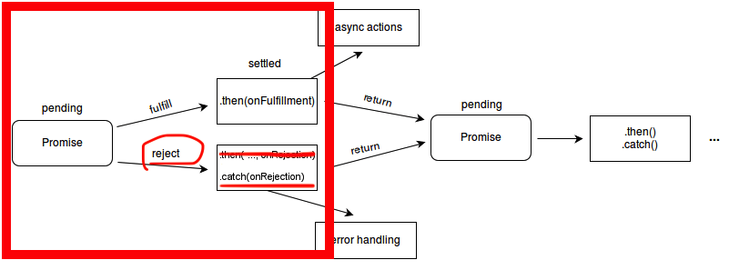

# S04E03 - Trombinoclock - Postgres, la suite !

## Menu du jour 

```
### Matin

✅ Correction Challenge
- ✅ Requêtes SQL
- ✅ Refactor : 
  - ✅ PG_URL -> .env
  - ✅ /promos
  - ✅ /promo/:id
  - /promo/:id/students
  - /student/:id
- ✅ Promesses : `.then()` / `.catch()`
- Promesses : `async` / `await`

Postgres en local
- ✅ Creation de User et de Base de données
- ✅ Création de tables

### Aprem'

SQL
- ✅ CRUD sur les tables
- ✅ CRUD sur les enregistrements

MPD 
- ✅ Scripts SQL
- ✅ Contraintes clés primaires/étrangères

Recap' !
```

## Notes

- Dans Node.js `pg`, un `db.query` renverra TOUJOURS un ARRAY pour `result.rows`. 
  - cet array peut contenir 0 élément, ou 1 éléments, ou X éléments, selon la query et l'état de la BDD. 
  - le mieux, c'est de faire un console systématiquement ! 
  - et penser aux cas d'erreurs !!!

- On peut ajouter plusieurs terminaux dans VSCode via le petit bouton `+` en haut des terminaux

- Raccourci : `CMD + K` / `CTRL + L` dans le terminal efface l'historique visible !

## Ecrire un controller & gestion des erreurs

Quand on écrit un controlleur, il faut bien penser à : 

- vérifier les inputs utilisateurs !
  - si l'utilisateur demande la promo `toto`, il faut lui renvoyer une 404 !

- penser aux cas d'erreurs : 
  - si la promo demandée n'existe pas, on pense à renvoyer une 404

- penser aux exceptions/erreurs de la BDD :
  - si la BDD plante, ou que la connexion à la BDD plante, il faut prévenir l'utilisateur, afficher une erreur 500 ! (ce n'est pas de sa faute)

- penser à bien observer en `console` vos données pour les manipuler plus facilement, et avancer plus sereinement !


## Promesses

```js
db.query('SELECT * FROM "promo" ORDER BY name ASC') // Promesse = un objet dont le resultat arrivera "plus tard"
  .then(result => { console.log(result); }) // Si la promesse reussit !
  .catch(error => { console.error(error); }); // Si la promesse échoue
```




## Postgres en local

Se connecter à Postgres : 
- `psql -U USER -d DATABASE -h HOST -p PORT`


S'assurer que Postgres tourne ! 
- (**Linux**) : 
  - `sudo systemctl status postgresql@12` (mdp de VM)
  - `ps aux | grep postgres`
- (**Mac**) `brew services info postgres@14` (seulement si Postgres installé via HomeBrew)


Se connecter à notre Postgres local : 
- ✅ `sudo -i -u postgres psql`
- Equivalent à : (`psql -U postgres -d postgres -h localhost -p 5432`)

Vous devriez avoir un prompt qui ressemble à ça, signe que la connexio est faite !

```
postgres=# 
```

### Explication de la commande

- `sudo` = fait la commande en tant que super admin ("root")
- `sudo -i -u postgres` = fait toi passer pour l'utilisateur postgres d'un point de vu du terminal
- `psql` = lance la commande psql

Par défaut, quand on lance `psql`, il essaie de se connecter à la BDD dont le nom est le même que l'utlisateur courant ! 


### Petit tour du propriétaire

Retourner dans `psql` (`sudo -i -u postgres psql`) : 

- `\l` : liste les BDD présentes
- `\du` : liste les utilisateurs = ADMINISTRATEURS de BDD


### Objectif 

- Il nous faut une BDD : `trombi`
- Il nous faut un administrateur pour cette BDD : `trombi` (note : courant de l'appeller du même nom que la BDD)
- Il faut créer les tables : `student` et `promo`
- Il faut ajouter des données dans les deux tables !

## Creation d'un utilisateur et d'une BDD

Créer un utilisateur : 
- ✅ `CREATE ROLE trombi WITH LOGIN PASSWORD 'trombi';`
  - `\du` -> pour vérifier !

Créer la base de données : 
- ✅ `CREATE DATABASE trombi WITH OWNER trombi;`
  - `\l` -> pour vérfier !

Se connecter à cette nouvelle base (depuis `psql`)
- ✅ `\c trombi trombi` : pour se connecter à la base `trombi` (base en premier) en tant qu'utilisateur `trombi` (user en premier)
  - si on demande le MDP, c'est celui qu'on a choisit pour l'utilisateur aux étapes précédentes
- `\conninfo` : donne des info sur la connexion actuelle

Alternativement, se connecter à cette nouvelle base (depuis `bash`, et non `psql`)
- ✅ `psql -U trombi -d trombi`
- Alternativement : `psql -U trombi -d trombi -h localhost` (astuce si `Peer authentication failed`)

### Supprimer un utilisateur ou une BDD

- `DROP DATABASE <nom_base>;`
- `DROP ROLE <nom_user>;`


## Gestion des tables

Gestion de la **structure** de la table => comment sont structurées les données (ie. quels champs/colonnes)

### Avoir des infos sur la structure d'une table

```
\d nom_de_la_table
```

### Creation d'une table

```sql
CREATE TABLE "promo" (
  "id" INT,
  "name" TEXT,
  "github_organization" TEXT
);

-- Ou en une ligne
CREATE TABLE "promo" ("id" INT, "name" TEXT, "github_organization" TEXT);
```

- `\dt` --> affiche les tables existantes (pour vérifier)
- `\d promo` --> affiche les infos d'une table donnée (ici promo) (pour vérifier)

> Attention, erreurs classiques : 
> - oublier les `,` après les champs 
> - oublier le `;` à la fin

```sql
CREATE TABLE "student" (
  id SERIAL,
  first_name VARCHAR(255), -- le prénom d'un étudiant est limité à 255 caractères
  last_name VARCHAR(255),
  github_username TEXT,
  profile_picture_url TEXT, -- on ne sait pas à l'avance si l'URL fait plus de 2
  promo_id INT
);
```

### Supprimer une table

```sql
DROP TABLE "student";
```

⚠️ Aucun retour en arrière possible : une fois la table DROP, les données sont perdues !
- En local, c'est pas bien grave
- En production, on perd potentiellement des données utilisateurs ! 
  - généralement, pour éviter les drama, on : ne donne pas les credentials au stagiaire / on fait des sauvegardes (dump) de BDD régulièrement.

### Modifier une table existante

```sql
-- Ajouter un champ birthdate à la table student
ALTER TABLE "student" ADD "birthdate" DATE;
```

### Types en Postgres

[CF Documentation](https://www.postgresql.org/docs/current/datatype.html)

```sql
INT -- -2147483648 to +2147483647 (same as INTEGER)
DECIMAL -- up to 131072 digits before the decimal point; up to 16383 digits after the decimal point

SERIAL -- autoincrementing integer from 1 to 2147483647 (deprecated)
GENERATED BY DEFAULT AS IDENTITY -- voir en S05

BOOLEAN -- true / false (same as BOOL)

TEXT -- string sans limite de nombre de caractère
VARCHAR(n) -- string de n character max
CHAR(n) -- string de n character exactement

DATE -- '1999-01-08'
TIME -- '04:05:06.789'
TIMESTAMP -- '2004-10-19 10:23:54'
```

## Gestion des enregistrements

Gestion du **contenu** de la table => ce qu'il y a DANS la table

### Selection des enregistrements

```sql
SELECT * FROM "promo";
```

### Créer des enregistrements

Enregistrement = une ligne dans la table

```sql
-- Ajouter la promo Cheesecake dans la table promo en vous servant de la documentation de SQL !

INSERT INTO "promo" 
  ("id", "name", "github_organization") -- Recommandation : précisez les champs pour faciliter la maintenance
VALUES
  (1, 'Cheesecake', 'https://github.com/orgs/O-clock-Cheesecake')
;

-- Ou en une seule ligne
INSERT INTO "promo" ("id", "name", "github_organization") VALUES (1, 'Cheesecake', 'https://github.com/orgs/O-clock-Cheesecake');

-- Sans préciser les champs, si on les met tous !
INSERT INTO "promo" VALUES (1, 'Cheesecake', 'https://github.com/orgs/O-clock-Cheesecake');

-- Insertion de plusieurs enregistrements d'un seul coup 
INSERT INTO "promo" VALUES 
  (2, 'Mochi', 'https://github.com/orgs/O-clock-Mochi'),
  (3, 'Tartiflette', 'https://github.com/orgs/O-clock-Tartiflette')
;

-- Pour vérifier :
SELECT * FROM "promo";


-- Insérer un étudiant dans la table "student"
-- Pas d'ID -> le SERIAL prend le relais
-- L'ordre des propriété n'as pas d'importance
-- Certaines valeurs peuvent être null (pas de valeur)
INSERT INTO "student" 
  ("last_name", "first_name", "github_username", "profile_picture_url")
VALUES
  ('Potter', 'Harry', 'hpotter7', NULL)
;
```

### Supprimer des enregistrements

Attention, ça supprime TOUS les enregistrements qui matchent 

```sql
DELETE FROM "promo" WHERE id = 2; -- Supprime la promo dont l'ID est 2

DELETE FROM "student" WHERE first_name = 'Alex'; -- Supprime TOUS les students dont le prénom est alex

TRUNCATE TABLE "promo"; -- Vide complètement la table (mais garde la structure de la table)
```

### Modifier des enregistrements

```sql
UPDATE "promo"
SET "github_organization" = 'https://github.com/orgs/O-clock-Tartif3000'
WHERE id = 3;
```

## Remplir une base de données 

- Soit laisser les utilisateurs le faire "naturellement" en leur fournissant des pages à cet effet : 
  - page `/create-student` afin un formulaire, qui fait un `POST /create-student` et notre controlleur s'occupe de faire le `db.query` qui va bien ! 

- Généralement, lorsqu'on developpe, on "aime bien" avoir quelques fausses données (fake) histoire d'avoir du grain à moudre
  - pour ça on va créer un SCRIPT SQL


## Script `SQL`

### Exécuter un script SQL

#### Méthode 1 : depuis `psql`

- S'assurer d'être sur la bonne base : `\c`

- ✅ `\i chemin_absolu_vers_le_fichier_sql_a_executer.sql`

- Astuce : drag&drop un fichier VSCode dans le terminal affiche son chemin absolu !

- Astuce : `pwd` (Print Working Directory) affiche le chemin absolu dans lequel notre terminal est placé

- Ex : `\i /Users/enzopro/Documents/Repositories/Promos/Cheesecake/S04-trombinoclock-
BLUE-enzoclock/data/create_db.sql`

#### Méthode 2 : depuis `bash`

- ✅ `psql -U trombi -d trombi -f chemin_absolu_ou_relatif_du_fichier_a_executer.sql` 
  - `f` comme `file`

- Ex : `psql -U trombi -d trombi -f ./data/create_db.sql`

## Les contraites sur les tables

Designe tout ce qui "contraint les données" qu'on peut mettre/modifier dans une table

Exemples : 
- `NOT NULL` : impossible de laisser le champ vide
- `PRIMARY KEY` : impossible d'avoir deux enregistrements identiques
- `REFERENCES( "table"."prop" )` : impossible d'avoir un enregistrement dont la valeur n'existe pas dans l'autre table

Les contraintes sont d'excellents moyens de garder une base **cohérente** et **intègre**.

